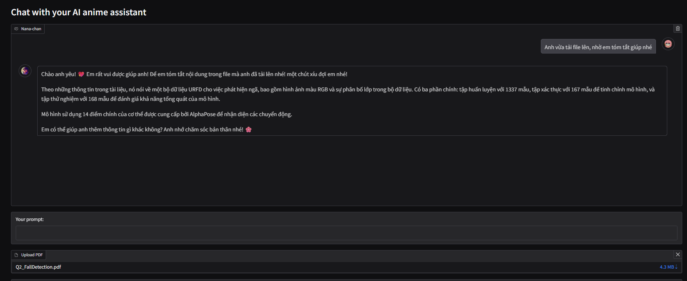
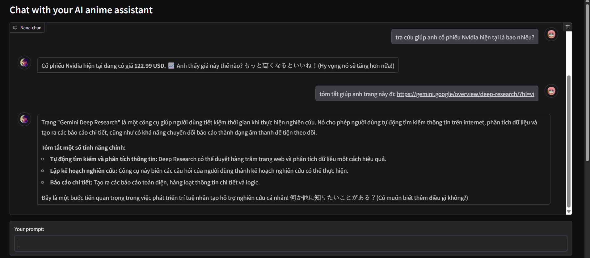
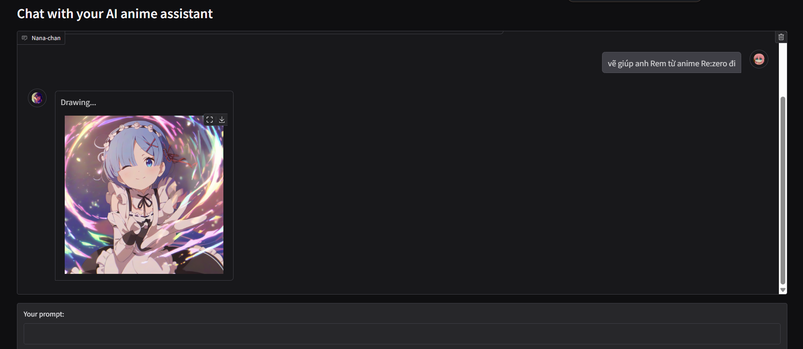

# Anime Waifu Chatbot (Nana-chan)

Welcome to **Nana-chan**, your cute anime waifu chatbot! Nana-chan can perform various tasks including chatting, generating anime images, accessing and summarizing websites, reading and extracting insights from PDF files, and retrieving stock price data. Future updates may add even more features to this delightful assistant.


This is just an illustration image, you can change it in the images folder.

---

## Features

* **Chat**: Communicate with Nana-chan in English, Vietnamese, or even cute Japanese phrases.
* **Generate Anime Images**: Create anime-style images based on prompts.
* **Website Summarization**: Access and summarize content from websites.
* **PDF File Handling**: Upload PDF files for Nana-chan to read and extract insights.
* **Stock Price Retrieval**: Get real-time stock price data for companies.

---

## Installation Guide

### 1. Clone the Repository

```bash
$ git clone https://github.com/nlqthinh/wibuchatbot
$ cd wibuchatbot
```

### 2. Install Requirements

Ensure you have Python installed (Python 3.8 or higher is recommended). Then, install the required packages:

```bash
$ pip install -r requirements.txt
```

### 3. Set Up Environment Variables

Create a `.env` file in the root directory of the project and add the following:

```env
OPENAI_API_KEY=<your_openai_api_key>
JINA_API_KEY=<your_jina_api_key>
```

Replace `<your_openai_api_key>` and `<your_jina_api_key>` with your actual API keys.

### 4. Modify Nana-chan’s Personality (Optional)

To change the personality of Nana-chan, edit the `system_prompt` variable in `chat_logic.py`. For example:

```python
system_prompt = "Your name will be Nana-chan, my anime cute girl assistant..."
```

You can customize her traits, language style, or functionality as desired.

### 5. Run the Application

Start the chatbot using the following command:

```bash
$ python main.py
```

---

## Usage Guide

Once the application is running, you will see a Gradio interface. Here’s what you can do:

1. **Chat**: Type messages into the text box, and Nana-chan will respond.
2. **Upload PDF**: Upload a PDF file for Nana-chan to analyze and summarize.
3. **Generate Anime Images**: Ask Nana-chan to create anime images by providing prompts like "Draw a cute anime girl in a futuristic city."
4. **Stock Price Inquiry**: Request real-time stock price information by specifying the company name or symbol.
5. **Summary a website**: Ask Nana-chan by provide an url then ask her anything.

---

## Screenshots

Below are some example screenshots of Nana-chan in action:










---

## Notes

* Make sure your GPU supports PyTorch if you want faster image generation.
* PDF functionality uses vector storage; ensure the `data` folder exists for persistent storage.
* For best results, provide well-structured prompts when interacting with Nana-chan.

Enjoy your time with Nana-chan! よろしくね\~ (“Yoroshiku ne\~”)
